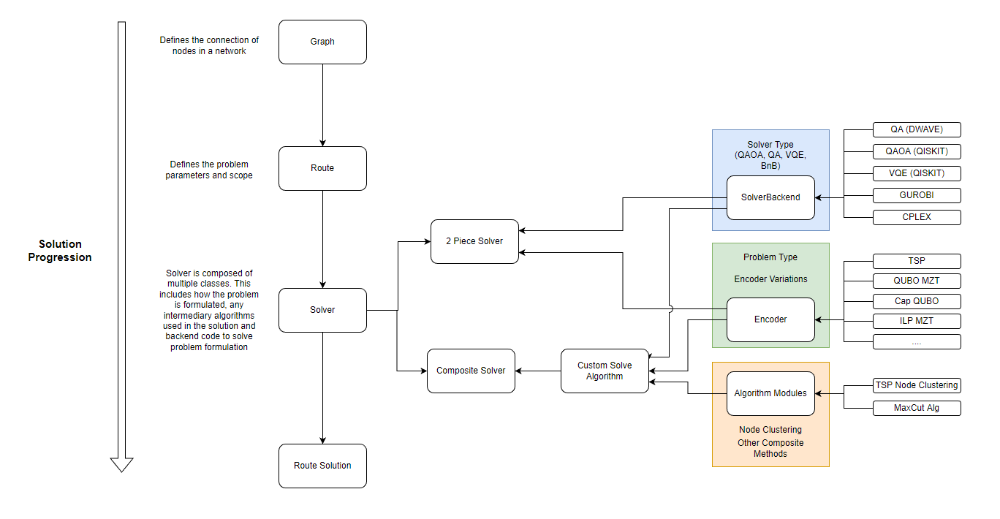
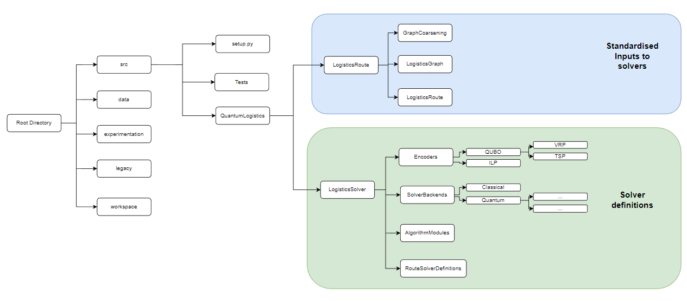
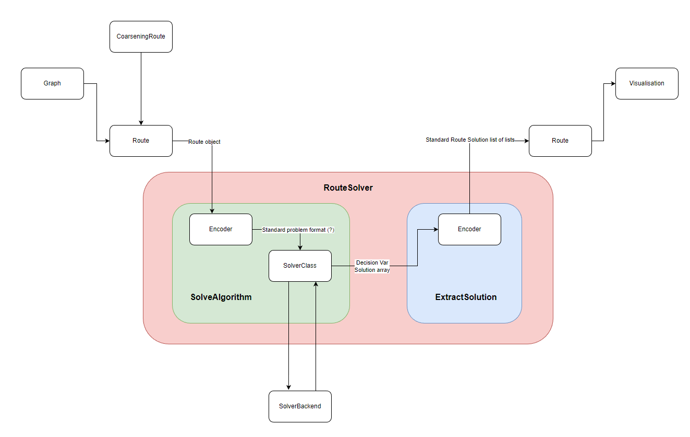
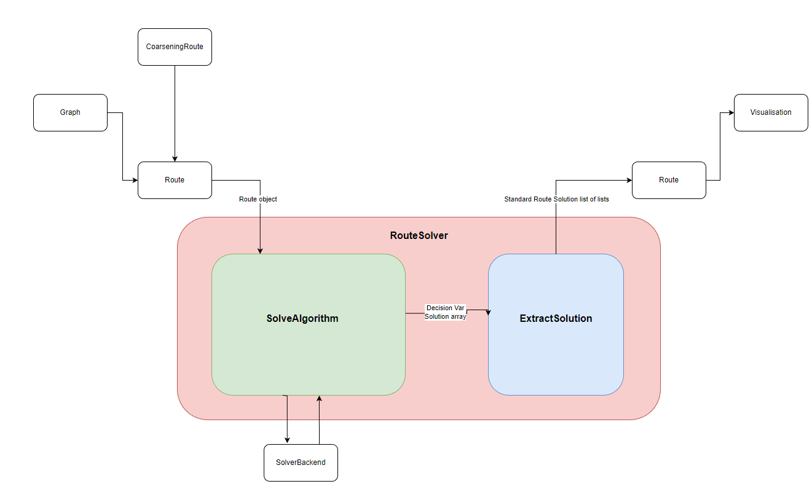

# Maintenance Guide

This is the new file structure for the Vehicle Routing Problem QIntern 2021 project. This was doen to standardise a file structure to avoid further merging issues and conflicts

run setup.bat to install all relevant modules

See workspace/LogisticsGraph/GraphCoarsening/exampleSolution.py for an example on how this module is used.

This folder structure is created to assist with the overall workflow of solving a logistics problem. In this flow, a standard logistics network is defined and key information is recorded. This input is then passed to a solver, which converts the problem into a mathematical formulaiton, passes the formulation to a solver (either quantum, classical or a composite combination) and then returns the result. This general process is presented in:

The directories used are as follows:

**Layout**
1. src:
    - The source code of the repo. This is stored in a single module - QuantumLogistics. This module is composed of several parts:
        - Logistics Route: ()
            - Logistics Graph - python object used to store and manipulate the graph information of the network being explored 
            - Logistics Route - python object storing all information pertaining to the VRP/TSP. This includes truck number, capacities etc. This also includes cost, maniuplation and visualistion functions
            - GraphCoarsening - module used in graph coarsening (down sampling) activities
        - Route Solver:
            - Encoders: Classes used to encode routes into standard mathematical formats (such as ILP, QUBO etc). This formulations will generally be problem dependant (TSP and VRP can use different formulations, additional constraints such as capacities and time windows will also change the formulation). Problem format (i.e the 'object' created by the encoder) will also be specific to certain solvers. I.e Pulp problems can only be used with pulp solvers. 
            - Solver Backends: Classes used to solve the encoded problem using open source software (i.e classical and quantum optimisers)
            - Solver Algorithm Modules: Components used during hybrid algorithms. Examples include node clustering.
            - Route Solvers: The definition files for complete route solvers. A route solver will generally consist of an encoder + backend solver. 

    - When adding to or modifying the source code make sure that the relevant setup.py file is up to date and that files are collected in a sensible manner 
        (i.e VQE specific backend solvers may be collected in a single file within SolverBackends/)

    
2. data: 
    - includes all routing network information used within over all experimentation

3. experiment:
    - Includes the overarching code used to generate results using the whole codebase.

4. Workspace:
    - This folder is used to develop code. Make sure an approriate sub-folder struct is used.

5. legacy:
    - This includes all previous code within the repository for reference. Ideally this will be removed once all code is converted to new format.

**A Note on Solver Construction**
Solvers represent the fundamental goal of the Quantum Logistics project. Solvers are generally implemented in two methods:

1. A 'Standard Solver' uses a single encoder and backendsolver pair. The encoder will convert the problem to a mathematical formulation and the backend will solve this formulation using 3rd party software. The encoder will then convert the answer into a route-interpretable format (a list of routes that each vehicle will take). Note, as encoders must output a format that is interpretable by a backendSolver, the format will have to be standardised. I.e quantum solvers may only accept qiskit QUBO objects whereas classical solvers will take ILP objects. Ideally, conversion from qiskit quobo to pulp QUBO will be investigated to directly compare solution times of standard problems. This is presented graphically in:

2. A 'Composite Solver' is a generalisation of 'Standard Solver'. Here, the solver must have a minumum of a 'solveAlgorithm()' and 'extractSolution()' method. These are user defined and allow for customisation of solution algorithm (such as more complex hybrid methods). *Only make a Composite Solver is your approach cannot be translate to a Standard Solver approach*. A Composite Solver is presented graphically in:

**Other**

From original Package template: 

This is a source template for a python packaged version of the code...

Pull this template to create a packaged version of the code, and override the classes `from VRP.Instance.Initializer`, `VRP.Route.Route`, `VRP.Visualization.visualize_route`, `VRP.ClassicalSolvers.ClassicalOptimizer`, etc by inheriting those classes and put your newly built code in a directory inside `./src/VRP/`.

** All the newly added code must be inside the `./src/VRP` directory as that is the main directory that get's installed when a `pip install` command is used.

You can run the `./setup.sh` file setup an environment(**virtual environment** or **venv**) and install the VRP package.

To use the VRP Package classes, an example is given in the `src/example` directory. One can follow the `sample.py` file in the example directory to understand the working of the current code. The current code in the `src/VRP` directory are all abstract classes that are meant to be inhereated in order to build the entire workflow of the VRP problem. 

## Suggestions
1.) Create a directory inside `./src/VRP/` say  **VRP_QAOA**. So now we have `./src/VRP/VRP_QAOA`.

2.) Add your code inside this new directory, say `./src/VRP/VRP_QAOA`. Make sure your classes in the code, say "QAOA Optimized Route" class is inherited from `VRP.Route.Route`. This will ensure that all the code are of correct format, like both say `VRP.QAOA_Route` and `VRP.VQE_Route`, both class will have almost the same parameters, as both will be inherited from the same abstract Route class.

3.) Use `VRP.Instance.Initializer` to create the graph instances, to build examples and tests.

4.) Write unit tests if possible. Some tests are already written in the directory `./src/test/`. We are using **pytest** package to run the unit tests.