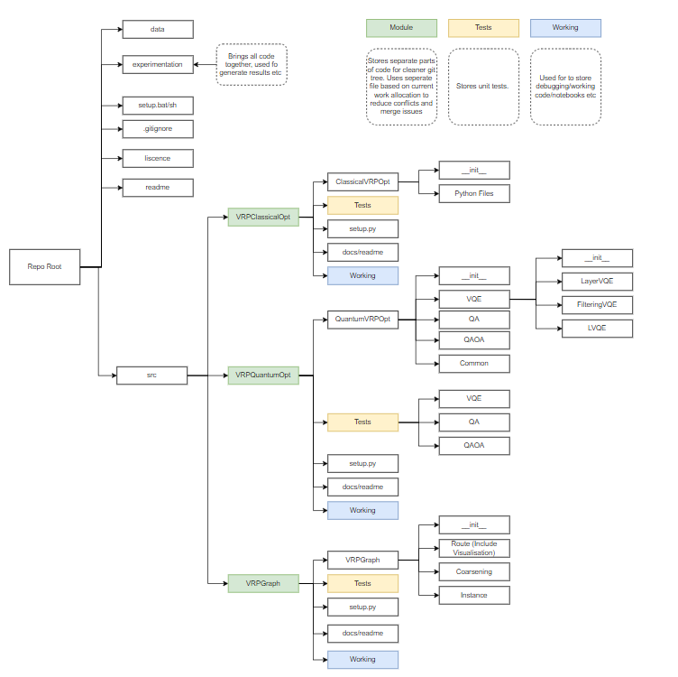

# Maintenance Guide

This is the new file structure for the Vehicle Routing Problem QIntern 2021 project. This was doen to standardise a file structure to avoid further merging issues and conflicts

run setup.bat to install all relevant modules

The directories used are as follows:

src:
    The source code of the repo. In this directory are three primary python modules:
        VRPCO - Classical Optimisation toolkit
        VRPGraph - Graph toolkit for the VRP
        VRPQO - Quantum Optimisation toolkit

    Within each python module is a setup file, python source files (defining the module functionality), a test folder (for all unit testing) and a workspace folder (for all notebooks and/or python files used to develop the code which are not official test cases or sample cases).

    When adding to or modifying the source code make sure that the relevant setup.py file is up to date and that files are collected in a sensible manner 
        (i.e under VRPQO.VQE.LayerVQE for a subvariant of the VQE algorithm)

    
data: 
    includes all routing network information used within over all experimentation

experiment:
    Includes the overarching code used to generate results using the whole codebase.

From original Package template: 

This is a source template for a python packaged version of the code...

Pull this template to create a packaged version of the code, and override the classes `from VRP.Instance.Initializer`, `VRP.Route.Route`, `VRP.Visualization.visualize_route`, `VRP.ClassicalSolvers.ClassicalOptimizer`, etc by inheriting those classes and put your newly built code in a directory inside `./src/VRP/`.

** All the newly added code must be inside the `./src/VRP` directory as that is the main directory that get's installed when a `pip install` command is used.

You can run the `./setup.sh` file setup an environment(**virtual environment** or **venv**) and install the VRP package.

To use the VRP Package classes, an example is given in the `src/example` directory. One can follow the `sample.py` file in the example directory to understand the working of the current code. The current code in the `src/VRP` directory are all abstract classes that are meant to be inhereated in order to build the entire workflow of the VRP problem. 

## Suggestions
1.) Create a directory inside `./src/VRP/` say  **VRP_QAOA**. So now we have `./src/VRP/VRP_QAOA`.

2.) Add your code inside this new directory, say `./src/VRP/VRP_QAOA`. Make sure your classes in the code, say "QAOA Optimized Route" class is inherited from `VRP.Route.Route`. This will ensure that all the code are of correct format, like both say `VRP.QAOA_Route` and `VRP.VQE_Route`, both class will have almost the same parameters, as both will be inherited from the same abstract Route class.

3.) Use `VRP.Instance.Initializer` to create the graph instances, to build examples and tests.

4.) Write unit tests if possible. Some tests are already written in the directory `./src/test/`. We are using **pytest** package to run the unit tests.